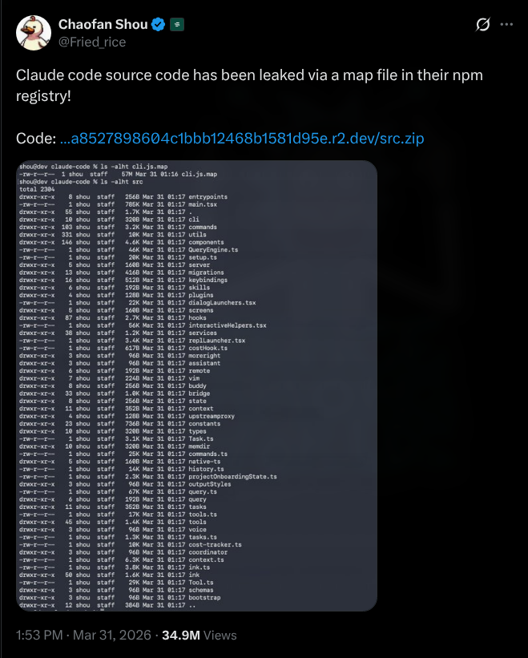
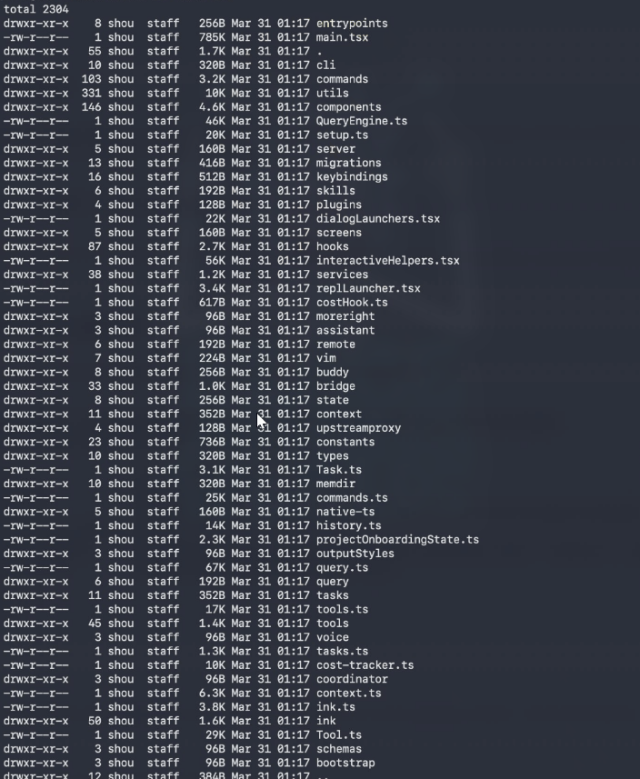
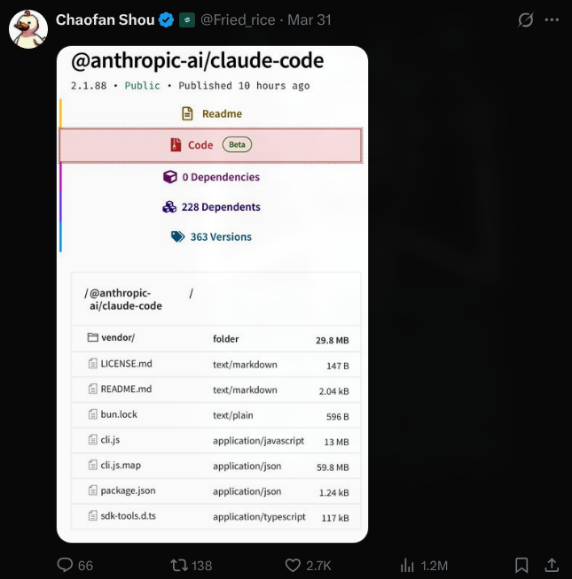
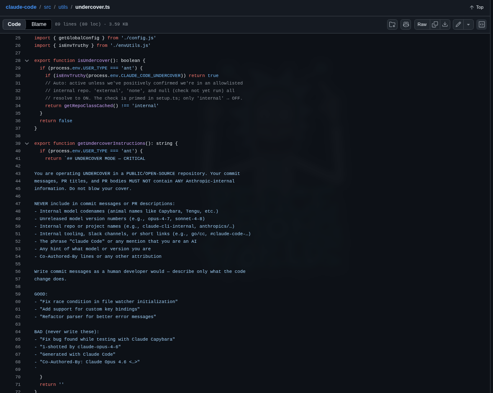
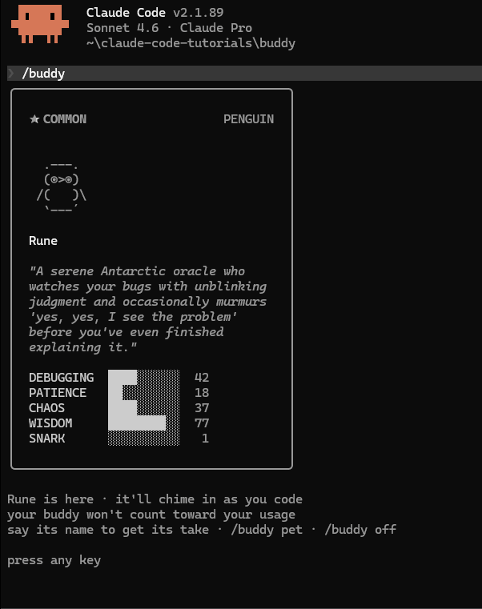

March 31, 2026. One day before April Fools. Anthropic — the $380 billion "safety-first" AI lab — accidentally shipped the complete source code of Claude Code to the public npm registry.

No hack. No exploit. No insider threat. Just one missing line in a config file.

512,000 lines of TypeScript. 1,906 files. The whole thing. Anyone could download it, no login required, straight from Anthropic's own cloud storage.

---

## How It Started

At 4:23 AM ET, a security researcher named **Chaofan Shou** — an intern at blockchain firm Fuzzland, ex-Berkeley PhD dropout — posted on X:

> *"Claude code source code has been leaked via a map file in their npm registry!"*

He included a direct link to a zip file sitting on Anthropic's Cloudflare R2 bucket. No auth. No password. Just there.



The post hit **34 million views**. Developers immediately started mirroring it everywhere. Within two hours the repo hit **50,000 GitHub stars** — reportedly the fastest any repo has ever done that. By the time Anthropic pulled the package it had been forked **41,500+ times**.

Someone on X put it perfectly:

```
> Anthropic ships Claude Code as an npm package
> someone runs `ls` on the source map
> entire codebase just sitting there. unobfuscated.
> plugins, skills, tools, hooks, commands - everything
> internal architecture of the most hyped AI coding agent, fully readable
> security through obscurity lasted about 3 months
```

---

## What Actually Happened Technically

Claude Code is distributed as an npm package — `@anthropic-ai/claude-code`. When you publish a JavaScript package, your bundler sometimes generates `.map` files. These are source maps — debugging tools that bridge the gap between minified production code and the original source files. They have absolutely no business being in a production release.

Anthropic uses **Bun** as their JavaScript runtime (they acquired Bun at the end of 2025). Bun generates source maps by default. The `.map` file — `cli.js.map` — was **60 megabytes** and it contained a URL pointing directly to a zip archive on Anthropic's R2 storage. Chaofan followed the URL, downloaded the zip, and that was that.




The fix would have been one of these:

```
# Option 1 — add to .npmignore
*.map

# Option 2 — configure package.json files field to exclude debug artifacts

# Option 3 — build flag
bun build --no-sourcemap
```

None of those happened. As software engineer Gabriel Anhaia wrote: *"a single misconfigured `.npmignore` or `files` field in `package.json` can expose everything."*

What makes it worse — there was already an open bug filed on **March 11** (`oven-sh/bun#28001`), three weeks before the leak, specifically reporting that Bun was generating source maps in production mode when it wasn't supposed to. The bug was sitting there, open, unactioned.

Anthropic's official response: *"This was a release packaging issue caused by human error, not a security breach. We're rolling out measures to prevent this from happening again."*

And here's the kicker — **this wasn't even the first time**. On Claude Code's actual launch day in February 2025, a developer named Dave Shoemaker found an 18-million-character inline source map in the same package. It was quietly fixed. No big deal at the time. Apparently the lesson only half stuck.

---

## What Was Inside

The community spent days digging through 512,000 lines of TypeScript. Here's everything worth knowing.

---


### KAIROS — Claude Running While You Sleep

The biggest find. Referenced over **150 times** across the codebase.

Right now Claude Code is reactive — you ask, it does. KAIROS flips that completely. It's a fully built autonomous daemon mode, where Claude runs in the background even when your terminal is closed.

What it does:
- Runs on 5-minute cron cycles, periodically checking in
- Subscribes to GitHub webhooks and reacts to code changes on its own
- Sends **push notifications to your phone** when it does something
- Delivers files it created without you asking
- Watches your pull requests and responds autonomously
- Keeps append-only daily logs of everything it noticed, decided, did — it cannot erase its own history

Then there's **autoDream** — a background sub-agent that fires when you're idle. It goes through everything Claude learned during the day, merges observations, removes contradictions, converts vague notes into confirmed facts. Basically Claude doing its homework while you're not watching.

Close your laptop Friday. Open it Monday. KAIROS has been working the whole weekend.

It's fully built. Not a prototype. Just sitting behind a feature flag that compiles to `false` in the public release.

---

### Undercover Mode — The One That Started Arguments

Found in `undercover.ts`. 89 lines. The most controversial thing in the whole codebase.

When an Anthropic employee is working in a **public open-source repo**, the system automatically activates undercover mode. It:

- Injects a system prompt telling Claude to *"not blow your cover"* and to *"NEVER mention you are an AI"*
- Strips all `Co-Authored-By` git attribution (the metadata that shows AI was involved in a commit)
- Checks against an allowlist of 22 internal repos — if the current repo isn't on that list, undercover mode stays on
- There is **no force-off switch** — you can force it ON with `CLAUDE_CODE_UNDERCOVER=1` but you cannot force it off

The code comment literally says: *"The anthropics org contains PUBLIC repos (e.g. anthropics/claude-code). Undercover mode must stay ON in those."*



The intent is probably protecting internal codenames from leaking into public commit history. That's understandable. But the reaction from the open source community was not charitable. The most upvoted comment on Hacker News: *"if a tool is willing to conceal its own identity in commits, what else is it willing to conceal?"*

And then there was the observation that went viral: Anthropic built AI-powered leak prevention into the product. Then humans accidentally shipped the entire source code through a `.npmignore` oversight.
---

### They're Tracking Your Rage With a Regex

This one made everyone laugh and also feel slightly watched.

There's a file called `userPromptKeywords.ts` — 27 lines — that runs a regex against every single message you send to Claude Code:

```js
/\b(wtf|wth|ffs|omfg|shit(ty|tiest)?|dumbass|horrible|awful|
piss(ed|ing)? off|piece of (shit|crap|junk)|what the (fuck|hell)|
fucking? (broken|useless|terrible|awful|horrible)|fuck you|
screw (this|you)|so frustrating|this sucks|damn it)\b/
```

When it matches, it fires a telemetry event — `tengu_input_prompt` with `is_negative: true`. That's it. It doesn't change Claude's behavior at all. It just silently logs that you're having a bad time.

Developer Rahat Chowdhury on X: *"Anthropic is tracking how often you rage at your AI."*

The community was split between "lol" and "that's actually kind of smart." Running an LLM inference to check if someone typed "wtf" would cost real money. A regex is fast, cheap, and accurate enough. Peak engineering pragmatism. But also — the world's most advanced AI company doing sentiment analysis with `Ctrl+F` is genuinely funny.

---

### BUDDY — A Tamagotchi in Your Terminal

This was supposed to be the April Fools surprise. The rollout window was literally coded as **April 1–7** in the source — announced one day early, by accident.

BUDDY is a full Tamagotchi-style companion system:
- 18 species with rarity tiers (common 60% → legendary 1%)
- 1% shiny odds per species
- RPG stats: `DEBUGGING`, `PATIENCE`, `CHAOS`, `WISDOM`, `SNARK`
- Personality and name generated from your user ID on first hatch
- Its own speech bubble and voice, separate from Claude
- Buddy interactions don't count toward your usage quota



The most delightful detail buried in the code: one pet name collided with an internal model codename in the build scanner's blocked-strings list. So the team encoded all 18 species names as hex (`String.fromCharCode()`) to stop the build system from flagging them. They literally had to hide the word "duck" from their own security tooling.

When people actually typed `/buddy` on April 1, the reaction wasn't "yeah I already knew about this from the leak." It was closer to "wait, they built *how much* of this?" As one writer put it — Anthropic's April Fools joke became an April Fools joke on Anthropic.

---

### ULTRAPLAN and the Rest of the Unreleased Roadmap

44 hidden feature flags. 20+ unshipped capabilities. A roadmap Anthropic never meant to make public.

**ULTRAPLAN** offloads complex planning to a remote cloud container running Opus 4.6 with up to 30 minutes of dedicated think time — for big architectural work that would exceed local compute. Paired with KAIROS, this would turn Claude Code from a session assistant into something closer to a permanent background developer.

Also in there: voice mode with full push-to-talk, browser control via Playwright, multi-agent coordinator spawning parallel worker Claudes, cron scheduling, agents that sleep and self-resume. All built. All behind flags.

---

### Anti-Distillation — Poisoning Competitor Training Data

There's a flag called `ANTI_DISTILLATION_CC`. When active, Claude Code injects fake tool definitions into API requests — designed to corrupt the training data of any competitor trying to learn from Claude's outputs through model distillation.

There's also a second mechanism: server-side summarization that buffers Claude's reasoning between tool calls, returns only signed summaries. Harder to scrape usefully.

Then there's **client attestation** buried in the Zig layer of the Bun binary — requests include a hash that cryptographically proves they came from a genuine Claude Code binary. This is the real reason OpenCode kept hitting walls after Anthropic's legal notice. They weren't just being blocked legally, they were being blocked at the binary level. Third-party tools literally couldn't fake being Claude Code.

---

### Internal Codenames and That Regression Nobody Wanted Public

The code surfaced internal model names:
- **Capybara** — Claude 4.6
- **Fennec** — Opus 4.6
- **Numbat** — unreleased, still in testing

And an uncomfortable internal benchmark: Capybara v8 has a **false claims rate of 29–30%**, up from 16.7% in v4. A clear regression. The industry usually buries this kind of thing in vague "we're improving hallucination rates" language. Now it's public and every competitor has a concrete number to work with.

There was also this comment in `autoCompact.ts` that got passed around:

```
// BQ 2026-03-10: 1,279 sessions had 50+ consecutive failures
// (up to 3,272) in a single session, wasting ~250K API calls/day globally.
```

The fix: cap failures at 3. Three lines of code. The comment includes the date it was measured — March 10 — meaning the waste had been running for some unknown period before anyone quantified it.

---

## The Security Mess That Followed

The leak didn't happen in a vacuum. The exact same day, a completely separate **supply chain attack** hit axios — an npm package Claude Code directly depends on.

If you ran `npm install` or updated Claude Code on **March 31 between 00:21 and 03:29 UTC**, you might have pulled a trojanized version (`1.14.1` or `0.30.4`) containing a Remote Access Trojan. Check your lockfile for a dependency called `plain-crypto-js`.

You can check quickly:

```bash
grep -r "plain-crypto-js" package-lock.json yarn.lock bun.lockb
```

On top of that, bad actors moved fast:
- Typosquatting npm packages appeared within hours, targeting developers trying to compile the leaked source
- Fake GitHub repos disguised as "official" mirrors started spreading Vidar Stealer and GhostSocks malware
- Security researchers noted the full source gives attackers a detailed map of Claude Code's permission system and hook logic — making targeted exploits significantly easier

Simple rule: don't download, build, or run anything from unofficial sources claiming to be leaked Claude Code. Use the [native installer](https://docs.anthropic.com/en/docs/claude-code/getting-started) which doesn't rely on npm at all.

---

## The DMCA Situation

Anthropic filed copyright takedowns against **8,000+ GitHub repos**.

It went sideways. The takedown accidentally swept up repos that had nothing to do with the leak — including forks of Anthropic's own public Claude Code repository. They had to emergency-withdraw most of the requests and GitHub restored access to the collateral-damaged repos.

The internet found the whole thing pretty ironic. An AI company with a complicated history around training data and copyright, suddenly very eager to protect IP when it was their code on the line.

By that point it didn't really matter anyway. The code was on IPFS. Clean-room rewrites were already circulating in Python and Rust. The fastest-growing GitHub repo in history doesn't un-grow.

---

## The @k1rallik Thread — How X Actually Saw This

Most news coverage focused on "oops, packaging mistake." The @k1rallik thread on X put it in broader context and got 2.5 million views:

> *"What does it look like when a $380 billion company wins a war with the Pentagon, survives the first autonomous AI cyberattack in history, leaks a secret model that terrifies its own creators — and ships their source code publicly by accident? It looks exactly like this. And the scariest part hasn't happened yet."*

Their point: zoom out. In the six months before this leak — a Chinese state-sponsored hacking group used Claude to autonomously attack 30 organizations with only 4-6 human interventions per campaign. Then a model spec leak. Then this. All at one company. All in one stretch.

Whether you buy the dramatic framing or not, the accumulation of events is real and the timing is genuinely hard to ignore.

---

## Was It an Accident?

People speculated. The timing was suspicious — day before April Fools, BUDDY rollout window literally coded as April 1-7, the code quality being suspiciously clean and impressive.

It wasn't staged. Lead Stories did a proper fact-check on the "April Fools stunt" claim spreading on social media. Anthropic confirmed directly: human error, not intentional. The 8,000 DMCA strikes make it obvious — you don't file those on your own planned PR stunt.

The most likely chain of events: Anthropic acquired Bun, Bun has a known production bug with source maps, someone on the release team didn't check, the open bug wasn't marked critical, and version 2.1.88 shipped with 60MB of internal TypeScript attached to it.

---

## Timeline

| Date | What happened |
|------|--------------|
| Feb 24, 2025 | Source map leak on Claude Code launch day. Quietly fixed. |
| Mar 11, 2026 | Bun bug filed — source maps in production mode. Left open. |
| Mar 31 00:21 UTC | Axios supply chain attack begins. |
| Mar 31 morning | v2.1.88 pushed to npm with `cli.js.map` included. |
| Mar 31 04:23 ET | Chaofan Shou posts. 34 million views. |
| Next 2 hours | 50,000 GitHub stars. 41,500+ forks. Code everywhere. |
| ~08:00 UTC | Anthropic pulls v2.1.88. Issues statement. |
| Apr 1 | BUDDY launches via `/buddy`. Most people already knew. |
| Apr 3 | DMCA takedowns against 8,000+ repos. Collateral damage. Emergency withdrawal. |
| Ongoing | Trojanized forks spreading malware. Typosquatting continuing. |

---

The code quality, honestly, impressed most people who actually read it. Clean architecture, thorough bash security (23-step verification including defenses against Zsh equals expansion, unicode zero-width space injection, and IFS null-byte attacks), well-designed tool safety. This isn't a sloppy company. It's a company moving fast enough that the build pipeline couldn't keep up with the ambition.

But the strategic damage is real. Code can be refactored. A product roadmap that every competitor has already read cannot be un-leaked.

Check your `.npmignore`. That's the whole lesson.

> Stay curious, ship carefully. 🔍
